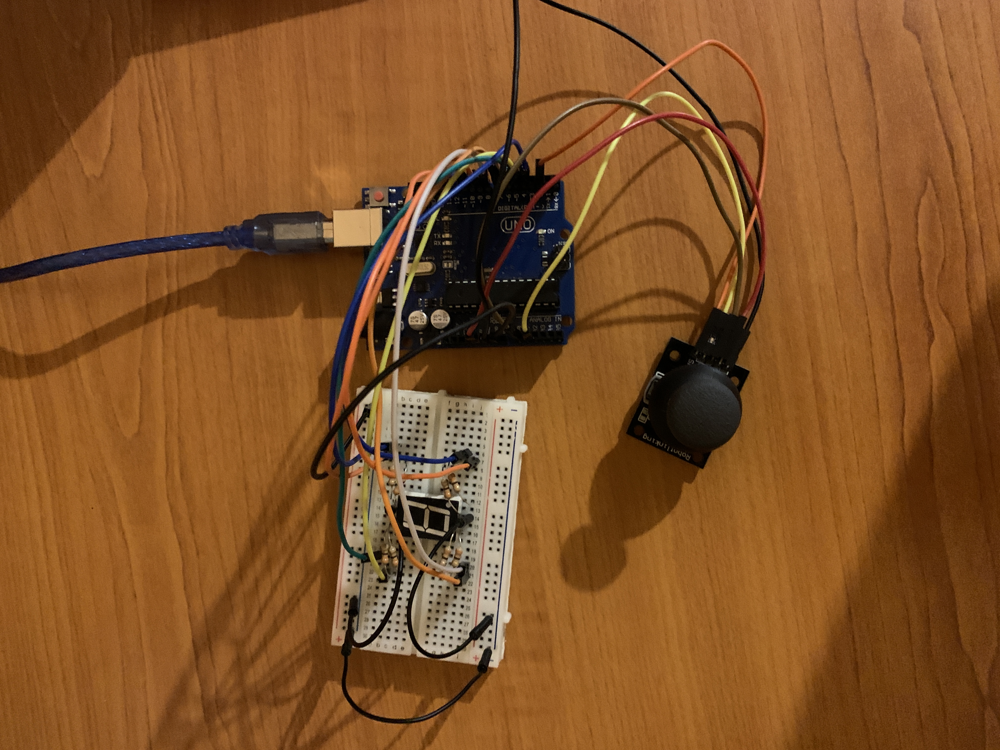

# IntroductionToRobotics (2023-2024)
This repository contains the assignments for the "Introduction to Robotics" course, taken in my third year at the Faculty of Mathematics and Informatics of the University of Bucharest.

## Table of contents
- [Homework 1](#homework-1)
- [Homework 2](#homework-2)
- [Homework 3](#homework-3)
- [Homework 4](#homework-4)

## Homework 1
### Requirement
Control each channel (red, green, blue) in an RBG LED using individual potentiometers.

### File
[Homework 1 file](homework1/homework1.ino)

<h3>Photo</h3>

### Video
https://www.youtube.com/watch?v=MONQZTE_G2A

## Homework 2
### Requirement
Simulate an elevator using at least 3 buttons and 3 LEDs corresponding to the floors.  
Pressing a button should move the elevator to the associated floor.  
While the elevator is moving between floors, there should be an additional LED signaling this.

### File
[Homework 2 file](homework2/homework2.ino)

<h3>Photo</h3>

### Video
https://www.youtube.com/watch?v=TdfMBzYgRU8

## Homework 3
### Requirement
Control a 7-segment display using a joystick. 
There should be a blinking segment to indicate the current selected segment. 
Upon pressing on the joystick, the segment should switch its state (from ON to OFF or from OFF to ON). 
The display should reset by long pressing the joystick.

### File
[Homework 3 file](homework3/homework3.ino)

<h3>Photo</h3>

### Video
https://www.youtube.com/watch?v=aXNt2QwVl8E

## Homework 4
### Requirement
Implement a timer using a 4-digit 7-segment segment display and three buttons.  
There should be one that button has start/pause functionality, one lap button, and one reset button.  
When the reset button is first pressed, it should reset the timer to 000.0 and toggle "lap viewing mode".  
In lap viewing mode, pressing the lap button should cycle through the last 4 saved laps. Pressing the reset button again should reset the timer completely.

### File
[Homework 4 file](homework4/homework4.ino)

<h3>Photo</h3>

### Video
https://www.youtube.com/watch?v=Ycb3rkpeRDs
